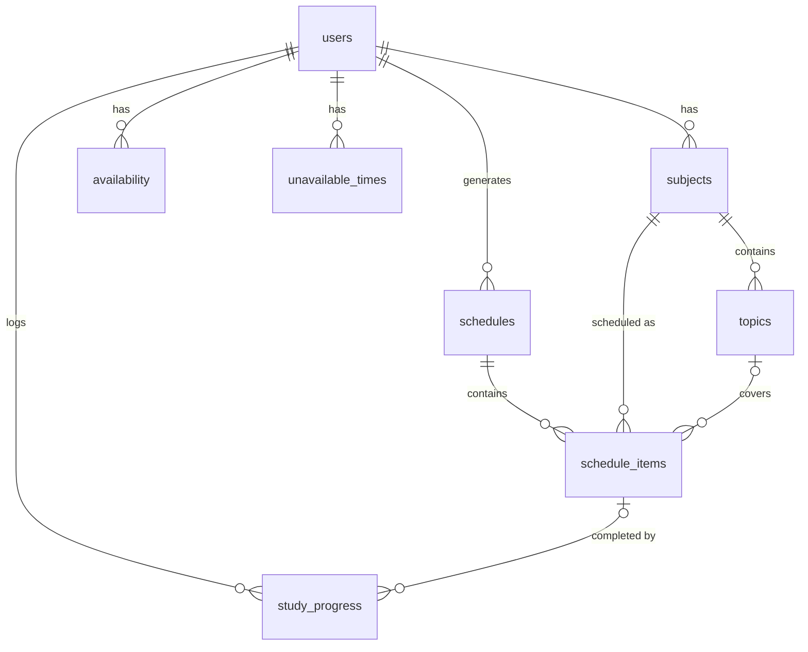

# Smart Study Scheduler
**ระบบเว็บช่วยจัดตารางอ่านหนังสืออัตโนมัติโดยใช้อัลกอริทึมพันธุกรรม**
*Web Application for Automatic Study Schedule Generation Using Genetic Algorithm*

```
Input → Constraint & Preference → Genetic Algorithm → Optimized Study Schedule → Visualization → Feedback
```

| Layer | Technology |
|---|---|
| Frontend | HTML5, CSS3 (ไม่มี framework), JavaScript (Vanilla, Fetch API) |
| Backend | PHP 8.1+ (PDO) — REST-style JSON API |
| Database | MySQL / MariaDB ผ่าน phpMyAdmin |
| Algorithm | Genetic Algorithm (PHP, แยกเป็นโมดูลอิสระใน `genetic/`) |
| Dev environment | XAMPP |

---

## 1. การติดตั้ง (XAMPP)

1. คัดลอกโฟลเดอร์ `smart-study-scheduler/` ไปไว้ที่ `C:\xampp\htdocs\` (หรือ `/opt/lampp/htdocs/`)
2. เปิด XAMPP Control Panel → Start **Apache** และ **MySQL**
3. เปิด phpMyAdmin (`http://localhost/phpmyadmin`) → แท็บ **Import** → เลือก `database/schema.sql` → **Go**
   (สคริปต์จะสร้างฐานข้อมูล `smart_study_scheduler` พร้อมข้อมูลตัวอย่าง)
4. เปิด `http://localhost/smart-study-scheduler/`
5. Login ด้วยบัญชีทดลอง **demo@example.com / demo1234** หรือสมัครสมาชิกใหม่

ค่าเชื่อมต่อฐานข้อมูลอยู่ใน `config/database.php` (ค่าเริ่มต้น `root` / ไม่มีรหัสผ่าน ตาม XAMPP)
หรือกำหนดผ่าน environment variables `DB_HOST`, `DB_PORT`, `DB_NAME`, `DB_USER`, `DB_PASS`

> ต้องใช้ **PHP 8.1 ขึ้นไป** (XAMPP 8.1/8.2 ขึ้นไป)

ทดสอบ GA จาก command line ได้โดยไม่ต้องมีฐานข้อมูล:

```bash
php tests/ga_test.php                                  # unit tests ของ GA (26 tests)
php genetic/benchmark.php                              # รัน GA 1 ครั้ง + พิมพ์ตาราง
php genetic/benchmark.php all --runs=5 --csv=results   # Experiment 1–4 + บันทึก CSV
```

---

## 2. ฟังก์ชันของระบบ

| หน้า | ฟังก์ชัน |
|---|---|
| **Login / Register** | สมัครสมาชิก, เข้าสู่ระบบ/ออกจากระบบ (password_hash, session, CSRF) |
| **Dashboard** | Today's Study (กด “อ่านแล้ว” ได้ทันที), Overall Progress, Subjects, Study Hours, Days Until Exam, กราฟแผน 7 วัน, วันสอบที่ใกล้มาถึง |
| **รายวิชา** | เพิ่ม/แก้ไข/ลบ/ดูรายละเอียดวิชา (Difficulty, Priority, Exam Date, Study Hours, Color) และจัดการหัวข้อ (Topics) |
| **เวลาว่าง** | เวลาว่างรายสัปดาห์ + ระดับความสะดวก (★–★★★), ช่วงเวลาที่ไม่สะดวก (ทุกสัปดาห์/เฉพาะวัน), ชั่วโมงที่ต้องการ/สูงสุดต่อวัน, ความยาว session, เวลาพัก, จำนวน session ติดกันสูงสุด |
| **สร้างตาราง (GA)** | ตั้งค่าพารามิเตอร์ GA → **Generate Study Schedule** → แสดง Fitness, กราฟ Convergence, Fitness Breakdown, เปรียบเทียบ Random/Rule-based, ประวัติเวอร์ชันของตาราง |
| **ตารางอ่านหนังสือ** | ปฏิทินรายสัปดาห์/รายวัน/รายการ — **ลากวาง** เพื่อเลื่อนเวลา, เปลี่ยนวิชา/หัวข้อ, เพิ่ม/ลบ session, ล็อก session, บันทึกอ่านแล้ว/ข้าม, Regenerate พร้อมคำเตือน ⚠️ เวลาชนกัน / นอกเวลาว่าง / หลังวันสอบ / เกินชั่วโมงต่อวัน / เวลาอ่านที่เหลือก่อนสอบ |
| **ความก้าวหน้า** | Study Hours Completed/Remaining, Topic Completion, Overall Progress, progress bar รายวิชา, ติ๊กหัวข้อ, กราฟชั่วโมงที่อ่าน 14 วัน, บันทึกการอ่านเพิ่มเติม, ประวัติ |
| **การทดลอง GA** | Experiment 1–4 (Population, Mutation rate, Generations, Baseline) รันจากหน้าเว็บได้ทั้งกับข้อมูลตัวอย่างและข้อมูลของผู้ใช้ |
| **ข้อมูลส่วนตัว** | แก้ไขชื่อ/อีเมล, เปลี่ยนรหัสผ่าน |

**Regenerate:** session ที่ *อ่านแล้ว*, *ข้าม*, *ล็อก 🔒* หรืออยู่ *ก่อนวันเริ่ม* จะถูกเก็บไว้ GA จะจัดเฉพาะชั่วโมงที่ยังเหลือ
(ชั่วโมงที่ต้องจัด = Study Hours − ชั่วโมงที่อ่านแล้ว − session ที่ล็อกไว้) และหัวข้อที่อ่านจบแล้วจะไม่ถูกจัดซ้ำ
ทุกครั้งที่ generate จะสร้าง “เวอร์ชัน” ใหม่ในตาราง `schedules` และย้อนกลับไปใช้เวอร์ชันเก่าได้

---

## 3. Architecture

```
 Browser (HTML/CSS/JS)  ──fetch JSON──▶  api/*.php  ──▶  includes/study_service.php  ──PDO──▶  MySQL
                                                                │
                                                                ▼
                                                    genetic/  (ไม่ติดต่อ DB)
                                     StudyProblem → GeneticAlgorithm → Best Chromosome → sessions
```

GA ถูกแยกเป็นโมดูลอิสระ: รับ array (วิชา, เวลาว่าง, ข้อจำกัด) และคืน array ของ session
ส่วน `includes/study_service.php` ทำหน้าที่ **GA ↔ Database Integration** (โหลดข้อมูล → สร้าง `StudyProblem` → รัน GA → บันทึกผล)
จึงทดสอบ GA ได้จาก CLI และนำไปทดลองเชิงวิจัยได้โดยไม่ต้องมีเว็บ

### โครงสร้างไฟล์

```
smart-study-scheduler/
├── index.php  login.php  register.php  logout.php
├── dashboard.php  subjects.php  availability.php  generate.php
├── schedule.php  progress.php  experiments.php  profile.php
├── config/database.php            # การเชื่อมต่อ DB + timezone
├── includes/
│   ├── bootstrap.php              # session, auth, CSRF, helpers
│   ├── api.php                    # api_run(), validation helpers
│   ├── study_service.php          # business logic + GA ↔ DB integration
│   ├── header.php  footer.php  auth_layout.php
├── api/
│   ├── subjects.php  topics.php  availability.php  schedule.php
│   ├── progress.php  dashboard.php  profile.php  experiments.php
├── genetic/
│   ├── problem.php                # สร้าง time slots + precompute
│   ├── chromosome.php             # encoding, random init, decode, seeded RNG
│   ├── population.php
│   ├── fitness.php                # Fitness Function
│   ├── selection.php              # Tournament Selection
│   ├── crossover.php              # day-uniform / one-point / two-point / uniform
│   ├── mutation.php               # reassign + move (swap)
│   ├── genetic_algorithm.php      # GA loop + elitism + termination
│   ├── baseline.php               # Random & Rule-based schedulers
│   ├── experiments.php            # ExperimentRunner (Exp. 1–4)
│   ├── sample_problem.php         # ชุดข้อมูลตัวอย่าง
│   └── benchmark.php              # CLI
├── assets/css/style.css
├── assets/js/  app.js charts.js dashboard.js subjects.js availability.js
│               generate.js schedule.js progress.js experiments.js profile.js
├── database/schema.sql
└── tests/ga_test.php
```

---

## 4. Database Design (8 ตาราง)



| ตาราง | หน้าที่ |
|---|---|
| `users` | ผู้ใช้ + การตั้งค่าการอ่าน (ชั่วโมงต่อวัน, ความยาว session, เวลาพัก, session ติดกันสูงสุด) |
| `subjects` | รายวิชา: difficulty (1–5), priority (Low/Medium/High), exam_date, total_hours, color |
| `topics` | หัวข้อของวิชา: estimated_hours, ลำดับ, สถานะ |
| `availability` | เวลาว่างรายสัปดาห์ (day_of_week 1=จันทร์ … 7=อาทิตย์) + preference |
| `unavailable_times` | ช่วงเวลาที่ไม่สะดวก (ทุกสัปดาห์ หรือเฉพาะวันที่) |
| `schedules` | ผลการรัน GA แต่ละครั้ง: fitness, parameters, fitness breakdown, fitness history (JSON) |
| `schedule_items` | Study session (gene ที่ decode แล้ว): วิชา, หัวข้อ, วันที่, เวลา, สถานะ, manual/locked |
| `study_progress` | บันทึกการอ่านจริง ใช้คำนวณความก้าวหน้า |

---

## 5. Genetic Algorithm Module

### Encoding
* ระบบสร้าง **time slot** จริงทุกช่วงตั้งแต่วันเริ่มถึงวันก่อนสอบวิชาสุดท้าย จากเวลาว่าง − ช่วงไม่สะดวก − session ที่ล็อกไว้
  โดยแบ่งช่วงว่างเป็น session ละ `session_minutes` คั่นด้วย `break_minutes`
  (เช่น 18:00–21:00, 60/15 นาที → 18:00–19:00, 19:15–20:15)
* **Chromosome** = ตาราง 1 แบบ = array ยาวเท่าจำนวน slot
* **Gene** `genes[i]` = วิชาที่อ่านใน slot *i* (−1 = ว่าง) → decode เป็น `[Monday, 18:00, Data Structures, Chapter 3]`
  (หัวข้อถูกเติมตามลำดับบทเรียน ส่วนที่เกินเป็น “ทบทวน”)
* slot หนึ่งมีได้วิชาเดียว ⇒ **ไม่มีเวลาชนกันโดยโครงสร้าง**

### Fitness Function (เต็ม 100 ก่อนหักโทษ)

| องค์ประกอบ | น้ำหนัก | ความหมาย (0–1) |
|---|---|---|
| Completion | 35 | ชั่วโมงที่จัดได้/ที่ต้องอ่าน ถ่วงด้วย importance = 0.6·priority + 0.4·difficulty |
| Exam Priority | 20 | อ่านในช่วง 14 วันก่อนสอบ (ไกลกว่านั้นคะแนนลดลงตามสัดส่วน) |
| Availability | 15 | ใช้ช่วงเวลาที่ผู้ใช้ระบุว่ามีสมาธิดี (★★★) |
| Study Balance | 15 | 1 − coefficient of variation ของชั่วโมงอ่านรายวัน |
| Continuity | 15 | อ่านเป็นบล็อกต่อเนื่อง (≤ max_consecutive) + กระจายหลายวัน |
| − Conflict Penalty | 5 / 2 | ต่อ session ในวัน/หลังวันสอบ / ต่อ session ที่ติดกันเกินกำหนด |
| − Overload Penalty | 3 | ต่อชั่วโมงที่เกินชั่วโมงสูงสุดต่อวัน |
| − Over-allocation | 1 | ต่อ session ที่เกินชั่วโมงที่ต้องอ่าน |

### Operators
* **Initial population**: สุ่ม — slot ถูกใช้ด้วยความน่าจะเป็น = ชั่วโมงที่ต้องอ่าน/ชั่วโมงว่าง และสุ่มเฉพาะวิชาที่ยังไม่สอบ
* **Selection**: Tournament (k = 3)
* **Crossover** (rate 0.8): *Day-uniform* — เลือกทั้งวันจากพ่อหรือแม่ (รักษาบล็อกการอ่านภายในวัน); มี one/two-point และ uniform ให้เปรียบเทียบ
* **Mutation** (rate 0.02 ต่อ gene): *Reassign* (เปลี่ยนวิชา/ว่าง) หรือ *Move* (สลับ slot = เลื่อนเวลาอ่าน)
* **Elitism**: เก็บ 2 ตารางที่ดีที่สุดไว้ทุก generation
* **Termination**: ครบ generation (200) / fitness ถึงเป้าหมาย / fitness ไม่ดีขึ้นต่อเนื่อง N generation

### Baselines
* **Random** — chromosome สุ่ม 1 ตัว
* **Rule-based** — Greedy Earliest-Deadline-First: วนทีละ slot เลือกวิชาที่สอบเร็วสุด (เสมอ → สำคัญกว่า) โดยเคารพชั่วโมงต่อวันและจำนวน session ติดกัน

ทุกวิธีถูกประเมินด้วย Fitness Function เดียวกัน

---

## 6. ผลการทดลอง (ชุดข้อมูลตัวอย่าง, 5 runs, `php genetic/benchmark.php all --runs=5`)

ชุดข้อมูล: 5 วิชา · 56 slots ใน 28 วัน · ต้องอ่าน 51 ชม. / เวลาว่าง 56 ชม.

| Experiment 1 — Population | Fitness (mean ± SD) | Time (ms) |
|---|---|---|
| 20 | 87.47 ± 0.77 | 117 |
| 50 | 87.77 ± 0.23 | 307 |
| 100 | 87.93 ± 0.16 | 624 |

| Experiment 2 — Mutation rate | Fitness | | Experiment 3 — Generations | Fitness | Time (ms) |
|---|---|---|---|---|---|
| 0.01 | 87.59 ± 0.70 | | 50 | 86.66 ± 0.47 | 100 |
| 0.05 | 87.52 ± 0.26 | | 100 | 87.68 ± 0.26 | 181 |
| 0.10 | 84.86 ± 0.65 | | 200 | 87.77 ± 0.23 | 303 |
| 0.20 | 81.02 ± 0.80 | | 500 | 87.93 ± 0.11 | 700 |

| Experiment 4 — Method | Fitness | Violations | ชั่วโมงที่จัด |
|---|---|---|---|
| Random | 50.42 ± 3.15 | 0.60 | 53.4 / 51 |
| Rule-based (EDF) | 86.82 | 0 | 51 / 51 |
| **Genetic Algorithm** | **87.77 ± 0.23** | 0 | 51 / 51 |

ข้อสังเกต
* Mutation rate สูง (≥ 0.10) ทำลายคำตอบที่ดี fitness ลดลงชัดเจน; 0.01–0.05 เหมาะสม
* Population/Generation มากขึ้นให้ fitness ดีขึ้นเล็กน้อยแต่เวลาเพิ่มเกือบเชิงเส้น → ค่า default 50 × 200 สมดุล (~0.3 วินาที)
* ชุดข้อมูลนี้เวลาว่างเกือบเต็ม (51/56 ชม.) ทางเลือกจึงน้อยและ Rule-based ทำได้ใกล้เคียง GA;
  เมื่อเวลาว่างมากกว่าที่ต้องอ่าน (ลดชั่วโมงเหลือ 31 ชม.) GA ได้ ~85.6 เทียบ Rule-based 78.6
  เพราะ greedy อัดการอ่านไว้ช่วงต้น (Balance = 0) ขณะที่ GA กระจายภาระได้ดีกว่า
  — ควรรายงานทั้งสองกรณีในเล่มโครงงาน

ผลจะต่างกันเล็กน้อยตามวันที่เริ่มและเครื่องที่ใช้ รันซ้ำได้ด้วยคำสั่งข้างต้น (seed คงที่ → ทำซ้ำได้)

---

## 7. ความปลอดภัย
* รหัสผ่านเก็บด้วย `password_hash()` (bcrypt)
* ทุก query ใช้ PDO prepared statements
* API ที่แก้ไขข้อมูลต้องเป็น POST + `X-CSRF-Token`
* ทุก API ตรวจว่าข้อมูล (วิชา, หัวข้อ, session) เป็นของผู้ใช้ที่ login อยู่
* Output ถูก escape (`e()` ใน PHP, `esc()` ใน JS)
* `.htaccess` ปิดการเข้าถึงโฟลเดอร์ `config/ includes/ genetic/ database/ tests/` จากเว็บ
* พารามิเตอร์ GA ถูกจำกัดขอบเขต (population ≤ 300, generations ≤ 1000) ป้องกัน server ค้าง

---

## 8. การแบ่งงาน (3 คน — Module Ownership)

| สมาชิก | ไฟล์หลักที่รับผิดชอบ |
|---|---|
| 1 — Algorithm & Optimization | `genetic/*`, `tests/ga_test.php`, การทดลองใน `experiments.php` |
| 2 — Backend & Database | `database/schema.sql`, `config/`, `includes/*`, `api/*`, login/register |
| 3 — Frontend & UX | หน้า `*.php` ระดับบนสุด, `assets/css/style.css`, `assets/js/*` |

ทุกคนควรอธิบายเส้นทางข้อมูลได้:
**หน้าเว็บ (generate.js) → `api/schedule.php?action=generate` → `study_service.php::build_problem_input()` (อ่าน DB)
→ `StudyProblem` → `GeneticAlgorithm::run()` (Fitness/Selection/Crossover/Mutation) → `Chromosome::decode()`
→ บันทึก `schedules`/`schedule_items` → `schedule.js` แสดงปฏิทิน**
